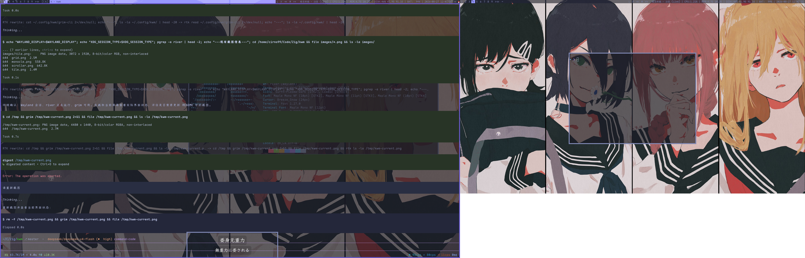

<div align="center">
    
</div>

# kwm - kewuaa's Window Manager

[River] is a non-monolithic Wayland compositor, it does not combine the
compositor and window manager into one program.

kwm is a DWM-like dynamic tiling window manager implementing the
river-window-management-v1 protocol.

# Screenshots




## Features

- **Layouts:** tile, grid, monocle, deck, scroller, centered master, and
  floating, with per-tag states
- **Tags:** organize windows with tags instead of workspaces, with shift-tags
  support
- **Rules:** regex pattern matching for window rules
- **Modes:** separate keybindings for each mode (default, lock, passthrough,
  custom)
- **Window States:** swallow, maximize, fullscreen, fake fullscreen, floating,
  sticky
- **Autostart:** run commands on startup
- **Status Bar:** dwm-like bar, supporting static text, stdin, and fifo, with
  customized colors
- **System Tray:** built-in StatusNotifierItem (SNI) support — kwm acts as both
  the host (displaying icons) and, when no other process owns the
  StatusNotifierWatcher name, the watcher itself, so no external tray/watcher
  tool is needed
- **Background:** optional solid color background (disabled by default)
- **Configuration:** support both compile-time and runtime configuration,
  reloading on the fly

See the default [configuration](./config.def.zon) file for detailed features.

## Dependencies

- wayland (libwayland-client)
- xkbcommon
- pixman (if bar enabled)
- fcft (if bar enabled)
- wayland-protocols (compile only)

## Build

Requires zig 0.16.x.

```
zig build -Doptimize=ReleaseSafe
```

- `-Dllvm`: force using LLVM compiler and linker (defaults to `true`; the
  self-hosted linker cannot relocate GCC 16's `.sframe` sections in crt1.o)
- `-Dconfig`: specify the default config file path (defaults to `config.zon`,
  copied from `config.def.zon` if missing)
- `-Dbackground`: enable or disable the solid background (defaults to `false`)
- `-Dbar`: enable or disable the status bar (defaults to `true`)
- `-Dkwim`: if to call [kwim] automatically (defaults to `true`)
- `-Dpie`: enable position-independent executables (defaults to `false`)
- `-Dversion-string`: override the `kwm -version` output

## Installation

<a href="https://repology.org/project/kwm-window-manager/versions">
  
</a>

See [packages.md] for community maintained packages.

```sh
zig build install -Doptimize=ReleaseSafe
```

- `--prefix`: specify the path to install files

## Configuration

### Compile Time

Make custom modifications in `config.zon` (if `-Dconfig` is not specified).

### Runtime

`kwm` searches for a user configuration in the following paths:

- `$XDG_CONFIG_HOME/kwm/config.zon`
- `$HOME/.config/kwm/config.zon`

The user configuration overrides compile-time configuration. You only need to
specify the values you want to change, rather than duplicating the entire
configuration.

User configuration can be reloaded on the fly with
<kbd>mod4</kbd>+<kbd>shift</kbd>+<kbd>r</kbd>.

## Configuration Preprocessing

Before loading the configuration, `kwm` can pre-process it by evaluating the
conditions, which allows per-host configuration.

Syntax:

```zig
// @include(file)
// @if(condition)
// @elif(condition)
// @else
// @endif
```

*Conditions* (separated by `,`):

- hostname=HOSTNAME
- env:KEY=VALUE
- env_contains:KEY

## Usage

Run `kwm` in your river init file, or start it with `river -c kwm`.

See `kwm(1)` man page for complete documentation.

See [Useful Software] in river wiki for compatible software.

### Keybindings

See [keybindings] or `KEYBINDINGS` section in `kwm(1)` man page for default
keybindings.

### Keymaps

Keyboard mapping can be customized by setting XKB layout rules before launching
river. For example, to swap <kbd>CapsLock</kbd> with <kbd>Escape</kbd>, and
<kbd>Mod1</kbd> with <kbd>Mod4</kbd>:

```sh
export XKB_DEFAULT_OPTIONS=caps:swapescape,altwin:swap_alt_win
```

See `xkeyboard-config(7)` man page for all options.

### Input Manager

There is an input device manager for river separated from `kwm` called [kwim],
implementing the river-input-management-v1 protocol and/or related protocols in
order to configure input devices independent of window manager.

When built with the `-Dkwim` option (defaults to `true`), `kwm` will call
`kwim` at startup. You can also run `kwim` to list input devices or apply a
single rule on demand.

## Acknowledgments

Thanks to the following reference projects:

- [river] - Wayland compositor
- [river-pwm] - River-based window manager
- [machi] - River-based window manager
- [dwl] - dwm for Wayland
- [swallow patch] - swallow window patch for dwl
- [mvzr] - regex support

## License

The source code of kwm is released under the [GPL-3.0].

The protocols in `protocol/` directory prefixed with river and developed by the
[River] project are released under the ISC license (as stated in their
copyright blocks).

kwm's logo is a recreation based on [River's logo] and released under the
CC-BY-SA-4.0 license.

## Contributing

Contributions are welcome! By contributing to kwm, you agree that your
submitted code will be licensed under [GPL-3.0]. It is the contributors'
responsibility to ensure that all submitted code is either original or
GPL-3.0-compatible.

[GPL-3.0]: ./LICENSE
[river]: https://codeberg.org/river/river
[packages.md]: ./doc/packages.md
[Useful Software]: \thttps://codeberg.org/river/wiki/src/branch/main/pages/useful-software.md
[keybindings]: ./doc/keybindings.md
[river-pwm]: https://github.com/pinpox/river-pwm
[machi]: https://codeberg.org/machi/machi
[dwl]: https://codeberg.org/dwl/dwl
[swallow patch]: https://codeberg.org/dwl/dwl-patches/src/branch/main/patches/swallow/swallow.patch
[mvzr]: https://github.com/mnemnion/mvzr
[River's logo]: https://codeberg.org/river/river/src/branch/main/logo/logo.svg
[kwim]: https://github.com/kewuaa/kwim

---

# kwm - kewuaa 的窗口管理器

[River] 是一个非单体（non-monolithic）的 Wayland 合成器，它不把合成器与窗口管理器合并为同一个程序。

kwm 是一个类似 DWM 的动态平铺窗口管理器，实现了 river-window-management-v1 协议。

# 截图


## 功能特性

- **布局（Layouts）：** tile、grid、monocle、deck、scroller、centered master 与 floating，且支持按标签（tag）保存各自的状态
- **标签（Tags）：** 用标签而非工作区来组织窗口，支持 shift-tags
- **规则（Rules）：** 基于正则表达式匹配的窗口规则
- **模式（Modes）：** 每个模式（default、lock、passthrough、custom）拥有独立的按键绑定
- **窗口状态（Window States）：** swallow（窗口合并）、maximize（最大化）、fullscreen（全屏）、fake fullscreen（伪全屏）、floating（浮动）、sticky（置顶）
- **自动启动（Autostart）：** 启动时自动运行命令
- **状态栏（Status Bar）：** 类似 dwm 的状态栏，支持静态文本、stdin 与 fifo，颜色可自定义
- **系统托盘（System Tray）：** 内置 StatusNotifierItem（SNI）支持——kwm 同时充当宿主机（显示图标）与（当没有其他进程持有 StatusNotifierWatcher 名称时）watcher 本身，因此无需任何外部托盘/watcher 工具
- **背景（Background）：** 可选纯色背景（默认关闭）
- **配置（Configuration）：** 同时支持编译期与运行时配置，并支持热重载

详细特性请参阅默认 [配置文件](./config.def.zon)。

## 依赖

- wayland（libwayland-client）
- xkbcommon
- pixman（启用状态栏时需要）
- fcft（启用状态栏时需要）
- wayland-protocols（仅编译期）

## 构建

需要 zig 0.16.x。

```
zig build -Doptimize=ReleaseSafe
```

- `-Dllvm`：强制使用 LLVM 编译器与链接器（默认 `true`；自托管链接器无法重定位 GCC 16 crt1.o 中的 `.sframe` 段）
- `-Dconfig`：指定默认配置文件路径（默认为 `config.zon`，缺失时从 `config.def.zon` 复制）
- `-Dbackground`：启用或禁用纯色背景（默认 `false`）
- `-Dbar`：启用或禁用状态栏（默认 `true`）
- `-Dkwim`：是否自动调用 [kwim]（默认 `true`）
- `-Dpie`：启用位置无关可执行文件（默认 `false`）
- `-Dversion-string`：覆盖 `kwm -version` 的输出

## 安装

<a href="https://repology.org/project/kwm-window-manager/versions">
  
</a>

社区维护的软件包请参阅 [packages.md]。

```sh
zig build install -Doptimize=ReleaseSafe
```

- `--prefix`：指定安装文件的路径

## 配置

### 编译期配置

在 `config.zon` 中进行自定义修改（若未指定 `-Dconfig`）。

### 运行时配置

`kwm` 按以下路径顺序查找用户配置：

- `$XDG_CONFIG_HOME/kwm/config.zon`
- `$HOME/.config/kwm/config.zon`

用户配置会覆盖编译期配置。你只需要指定想修改的值，而无需复制整个配置。

用户配置可通过 <kbd>mod4</kbd>+<kbd>shift</kbd>+<kbd>r</kbd> 热重载。

## 配置预处理

在加载配置之前，`kwm` 会先对配置进行预处理（求值条件），从而支持按主机（per-host）定制配置。

语法：

```zig
// @include(file)
// @if(condition)
// @elif(condition)
// @else
// @endif
```

*条件*（以 `,` 分隔）：

- hostname=HOSTNAME
- env:KEY=VALUE
- env_contains:KEY

## 使用

在 river 的 init 文件中运行 `kwm`，或通过 `river -c kwm` 启动。

完整文档请参阅 `kwm(1)` 手册页。

与 kwm 兼容的软件请参阅 river wiki 中的 [Useful Software]。

### 按键绑定

默认按键绑定请参阅 [keybindings] 或 `kwm(1)` 手册页中的 `KEYBINDINGS` 章节。

### 键盘映射（Keymaps）

可以通过在启动 river 前设置 XKB 布局规则来自定义键盘映射。例如，交换 <kbd>CapsLock</kbd> 与 <kbd>Escape</kbd>、<kbd>Mod1</kbd> 与 <kbd>Mod4</kbd>：

```sh
export XKB_DEFAULT_OPTIONS=caps:swapescape,altwin:swap_alt_win
```

所有选项请参阅 `xkeyboard-config(7)` 手册页。

### 输入管理器（Input Manager）

有一个与 `kwm` 分离的、面向 river 的输入设备管理器，名为 [kwim]，它实现 river-input-management-v1 协议及/或相关协议，从而独立于窗口管理器配置输入设备。

当使用 `-Dkwim` 选项构建（默认 `true`）时，`kwm` 会在启动时调用 `kwim`。你也可以手动运行 `kwim` 来列出输入设备或按需应用单条规则。

## 致谢

感谢以下参考项目：

- [river] - Wayland 合成器
- [river-pwm] - 基于 River 的窗口管理器
- [machi] - 基于 River 的窗口管理器
- [dwl] - Wayland 版的 dwm
- [swallow patch] - dwl 的 swallow 窗口补丁
- [mvzr] - 正则表达式支持

## 许可证

kwm 的源代码以 [GPL-3.0] 协议发布。

`protocol/` 目录下以 river 前缀命名、由 [River] 项目开发的协议以 ISC 许可证发布（详见各文件版权块）。

kwm 的 logo 是基于 [River's logo] 再创作的，以 CC-BY-SA-4.0 许可证发布。

## 贡献

欢迎贡献！向 kwm 提交贡献即表示你同意你所提交的代码将以 [GPL-3.0] 协议许可。贡献者有责任确保所有提交的代码要么是原创的，要么与 GPL-3.0 兼容。

[GPL-3.0]: ./LICENSE
[river]: https://codeberg.org/river/river
[packages.md]: ./doc/packages.md
[Useful Software]: \thttps://codeberg.org/river/wiki/src/branch/main/pages/useful-software.md
[keybindings]: ./doc/keybindings.md
[river-pwm]: https://github.com/pinpox/river-pwm
[machi]: https://codeberg.org/machi/machi
[dwl]: https://codeberg.org/dwl/dwl
[swallow patch]: https://codeberg.org/dwl/dwl-patches/src/branch/main/patches/swallow/swallow.patch
[mvzr]: https://github.com/mnemnion/mvzr
[River's logo]: https://codeberg.org/river/river/src/branch/main/logo/logo.svg
[kwim]: https://github.com/kewuaa/kwim
